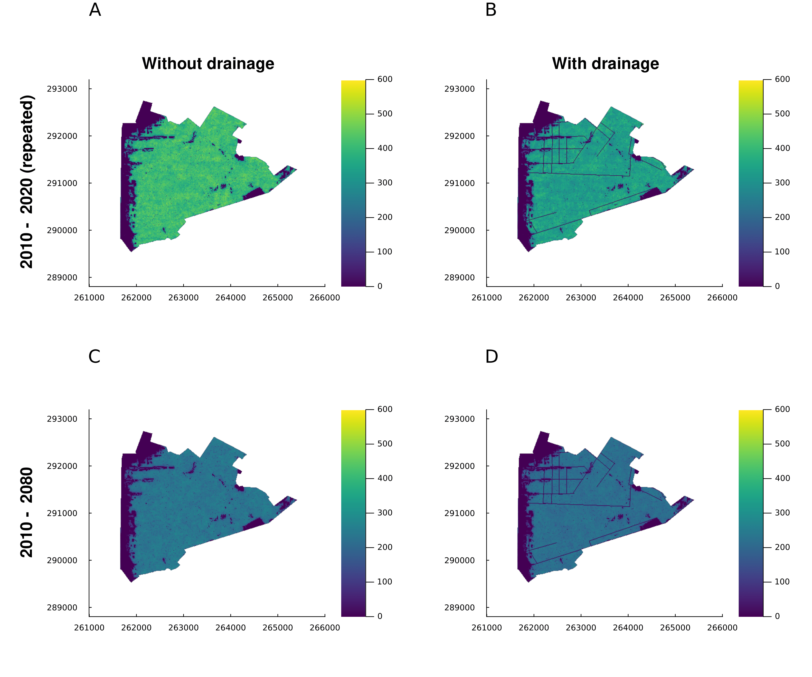

# Peatland.jl

| **Documentation** | **Build Status** | **DOI** |
|:-----------------:|:----------------:|:-------:|
|  | [![build tests][actions-img]][actions-url]  |  |
|  | [![codecov][codecov-img]][codecov-url] |  |

*Package for running simulations of peatland vegetation and environment.*

## Summary

This codebase provides example runs for the NERC Landscape Decisions Project: Simulating UK plant biodiversity under climate change to aid landscape decision making. This particular section of the project aims to provide a dynamic model of peatland plant biodiversity in Wales and Scotland.

The underlying simulation code for this project can be found at [EcoSISTEM.jl](https://github.com/EcoJulia/EcoSISTEM.jl).

[actions-img]: https://github.com/boydorr/Peatland.jl/actions/workflows/testing.yaml/badge.svg
[actions-url]: https://github.com/boydorr/Peatland.jl/actions

[codecov-img]: https://codecov.io/gh/boydorr/Peatland.jl/branch/main/graph/badge.svg?token=M62CXNJPIP
[codecov-url]: https://codecov.io/gh/boydorr/Peatland.jl?branch=main
